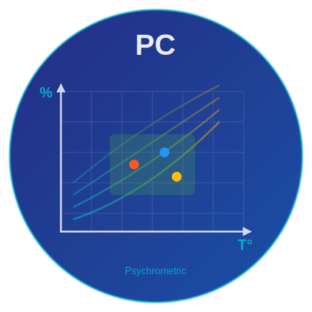

<div align="center">
  

  # Psychrometric Chart for Home Assistant

  [](https://github.com/hacs/integration)
  [](https://github.com/guiohm79/psychrometric-chart-advanced/releases)
  [](LICENSE)

  **Langue :** [🇬🇧 English](README.md) | [🇫🇷 Français](README.fr.md)
</div>


## Description

Ce projet propose une carte personnalisée pour **Home Assistant**, permettant de visualiser un **diagramme psychrométrique** basé sur les données de température et d'humidité des capteurs. La carte calcule également des valeurs clés comme l'enthalpie, la teneur en eau et la température de rosée. Elle indique si des actions sont nécessaires pour réchauffer, refroidir, humidifier ou déshumidifier, tout en estimant les puissances nécessaires pour atteindre la **zone de confort**.

## Fonctionnalités

### 📊 Visualisation avancée
- **Diagramme psychrométrique interactif** entièrement responsive
- **Design moderne** avec effets glassmorphism et animations fluides
- **Graphique adaptatif** qui s'ajuste automatiquement à la taille de l'écran (mobile, tablette, desktop)
- **Tooltips au survol** des points avec informations détaillées

### 📈 Historique des données
- **Modal popup élégant** affichant l'historique sur 24 heures
- **Graphiques d'évolution** pour température et humidité
- **Statistiques détaillées** : min, max, moyenne
- **Clic sur les valeurs** de température ou humidité pour voir l'historique
- Intégration native avec l'API History de Home Assistant

### 🎨 Interface utilisateur améliorée
- **Cartes modernes** avec dégradés, ombres portées et effets de profondeur
- **Animations fluides** lors du chargement et des interactions
- **Badges de statut** indiquant si les valeurs sont dans la zone de confort
- **Icônes émojis** pour une meilleure lisibilité
- **Mode sombre** optimisé avec contraste amélioré

### 📐 Zone de confort personnalisable
- Température min/max ajustable
- Humidité relative min/max configurable
- Couleur personnalisable pour la zone
- Indicateurs visuels clairs

### 🔬 Calculs scientifiques affichés
- Température de rosée
- Teneur en eau
- Enthalpie
- Humidité absolue
- Température de bulbe humide
- Volume spécifique
- Indice PMV (confort thermique)
- Risque de moisissure avec code couleur
- Puissances estimées pour chauffer/refroidir/humidifier/déshumidifier

### ⚙️ Options graphiques avancées
- Courbes d'humidité relative (10 % à 100 %)
- Courbes d'enthalpie optionnelles
- Points de rosée visualisés
- Lignes pointillées vers les axes
- Légende animée et personnalisable
- Débit massique ajustable pour calculs de puissance précis

### 🌍 Multilingue
- Interface en **français** et **anglais**
- Configurable via le paramètre `language`
- Tous les labels et messages traduits

---

## Installation

### Via HACS (recommandé)

1. Assurez-vous d'avoir [HACS](https://hacs.xyz/) installé dans Home Assistant
2. Ouvrez HACS dans Home Assistant
3. Allez dans "Frontend"
4. Cliquez sur le bouton "+" en bas à droite
5. Recherchez "Psychrometric Chart"
6. Cliquez sur "Installer"
7. Redémarrez Home Assistant

### Installation manuelle

1. **Téléchargez les fichiers** de ce dépôt
2. Placez le fichier **`psychrometric-chart-advanced.js`** dans le dossier **`www/custom-lovelace/psychrometric/`** de votre installation Home Assistant
3. Ajoutez le fichier à votre tableau de bord via **Configuration > Tableaux de bord > Ressources** :
   - URL : `/local/custom-lovelace/psychrometric/psychrometric-chart-advanced.js`
   - Type : **Module JavaScript**
4. Rechargez l'interface Lovelace dans Home Assistant (CTRL+F5 ou vider le cache)

### Prérequis

- Home Assistant 2024.1.0 ou supérieur
- L'**historique** doit être activé dans votre configuration Home Assistant pour profiter de la fonctionnalité d'historique

---

## Utilisation

Ajoutez cette configuration YAML à votre tableau de bord dans **Home Assistant** :

```yaml
type: custom:psychrometric-chart-enhanced
language: fr  # 'fr' pour français, 'en' pour anglais (défaut: 'fr')
points:
  - temp: sensor.bme680_temperature
    humidity: sensor.bme680_humidite
    color: "#ff0000"
    label: Chambre parents
    icon: mdi:bed
  - temp: sensor.module_interieur_branche_chambre_noah_temperature
    humidity: sensor.module_interieur_branche_chambre_noah_humidite
    color: "#0000ff"
    label: Chambre Noah
    icon: mdi:bed
  - temp: sensor.module_interieur_branche_module_exterieur_asco_temperature
    humidity: sensor.module_interieur_branche_module_exterieur_asco_humidite
    color: "#00ff00"
    label: Exterieur
  - temp: sensor.module_interieur_branche_temperature
    humidity: sensor.module_interieur_branche_humidite
    color: "#8B4513"
    label: Salon
    icon: mdi:sofa
bgColor: "#000000"
textColor: "#ffffff"
gridColor: rgba(0, 238, 254, 0.15)
curveColor: "#3B58DD"
showCalculatedData: true
comfortRange:
  tempMin: 18
  tempMax: 22
  rhMin: 40
  rhMax: 60
comfortColor: rgba(144, 238, 144, 0.3)
massFlowRate: 0.5
chartTitle: Diagramme Psychrométrique
darkMode: true
showMoldRisk: true
displayMode: advanced
showEnthalpy: true
showLegend: false
showPointLabels: true
